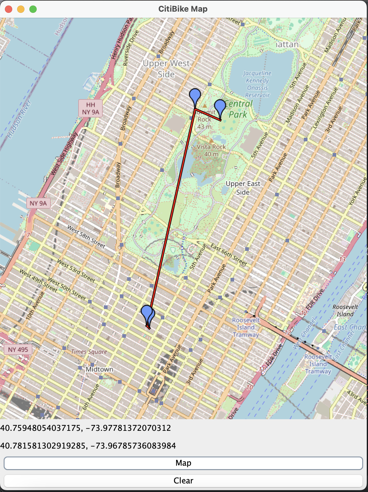

# CitiBike Route Finder

The CitiBike Lambda project helps users find the nearest CitiBike stations to rent
or return bikes based on two location points. Users can select starting and destination 
points on an interactive map, and the system finds nearby stations with bike availability. 
Data is fetched from CitiBike's API and stored in AWS S3 for faster access. 
The project uses AWS Lambda, S3, and JXMapViewer to create a quick and efficient solution for users.

## CitiBike JSON Files
JSON files containing the information about the CitiBike Stations
* [Station Information](https://gbfs.citibikenyc.com/gbfs/en/station_information.json)
* [Station Status](https://gbfs.citibikenyc.com/gbfs/en/station_status.json)
